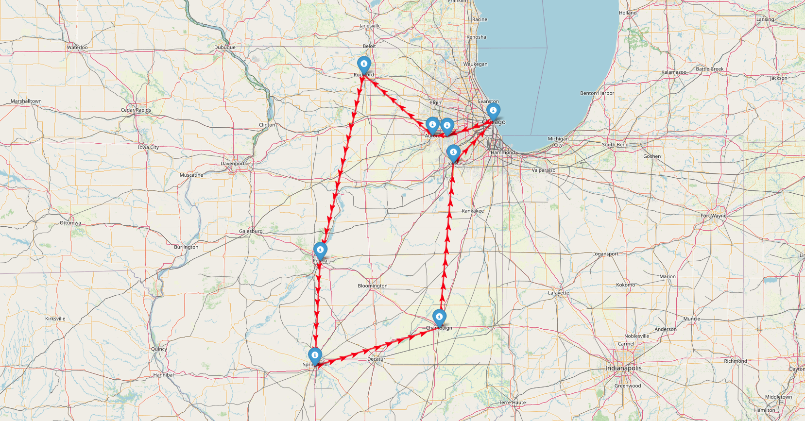

# 🚚 LogisticRouteOptimization

A Python-based project for **intercity delivery route optimization** across the state of **Illinois**, using real geospatial data, road networks, and graph theory.

This project aims to minimize delivery time and fuel consumption by solving routing problems between major cities in Illinois.

---

## Features

*  Load and process real Illinois city coordinates
* ️ Download and cache Illinois road network with **OSMnx**
*  Match cities to nearest road nodes in the network
*  Compute distance matrix for route optimization
*  Visualize cities and paths using **Folium** and **GeoPandas**
*  Plan optimal delivery routes using **Google OR-Tools**

---

## Technologies Used

* Python 3.13+
* [pandas](https://pandas.pydata.org/)
* [geopandas](https://geopandas.org/)
* [osmnx](https://github.com/gboeing/osmnx)
* [networkx](https://networkx.org/)
* [ortools](https://developers.google.com/optimization)
* [folium](https://python-visualization.github.io/folium/)

---

## Project Structure

```
LogisticRouteOptimization/
│
├── data/
│   ├── distance_matrix.csv
│   ├── illinois_cities.csv
│   ├── illinois_graph.graphml
│   └── tsp_result.json
│
├── images/
│   └── tsp_illinois_route.png
│
├── notebooks/
│   └── routes_analysis.ipynb
│
├── src/
│   ├── __init__.py
│   ├── cities_dataset_generator.py
│   ├── graphml_generator.py
│   ├── logging_config.py
│   └── tsp_solver.py
│
├── output/
├── .gitattributes
├── .gitignore
├── .pre-commit-config.yaml
├── LICENSE
├── README.md
└── requirements.txt
```

---

## Getting Started

1. **Clone the repo:**

```bash
git clone https://github.com/your-username/LogisticRouteOptimization.git
cd LogisticRouteOptimization
```

2. **Install dependencies:**

```bash
pip install -r requirements.txt
```

3. **Run notebook:**
   Open `notebooks/routes_analysis.ipynb`.

---

## Target Area

This project currently focuses on major cities in **Illinois**, including:

* Chicago
* Aurora
* Rockford
* Naperville
* Springfield
* Peoria
* Champaign
* Joliet

---

## Optimal Route Map
Here is the TSP-optimized delivery route between major cities in Illinois:



---

## License

This project is licensed under the terms of the [LICENSE](./LICENSE).

## Credits

This repository and project were created by [Ivan Grigorev](https://github.com/Ivan-Grigorev).
